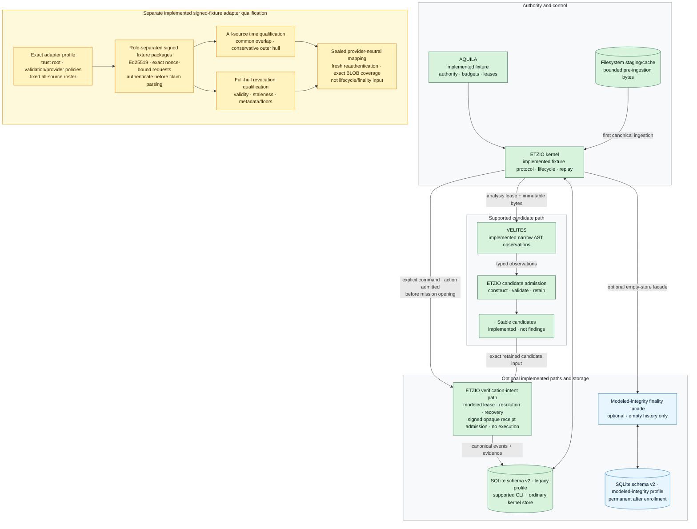
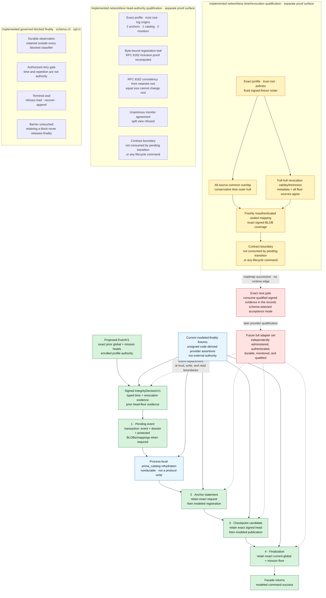

# Etzio

**An evidence-native engine for authorized vulnerability research: a candidate becomes a
finding only when a separately authorized verifier reproduces a material effect from
retained bytes and the kernel accepts the receipt — proof by reproduction, not by
confidence.**

> **Honest status — 2026-08-01. Phase: foundation integrity. This is the courtroom, not
> yet the detective.**
>
> Etzio has built an evidence and adjudication kernel to a high standard. It has *not* built
> the part that finds vulnerabilities. The entire detection surface today is **six Python
> rule classes over two repository fixtures** — `7` planted candidates on the vulnerable
> fixture, `0` on the clean one, and **never a finding**. The kernel can prove a claim; it
> cannot yet make one worth proving.
>
> Nothing here touches the outside world. No live target, exploit execution, isolation host,
> benchmark corpus, external provider, credential, network egress, spend, or disclosure is
> authorized or reachable — the only execution surface is repository-owned deterministic
> fixtures. No trustworthy UTC, current real-world revocation, external durability,
> non-equivocation, independent verification, finding, live-target authority, or superiority
> claim follows from anything in this repository.
>
> What *is* implemented, end to end on those fixtures: a canonical protocol-v1 envelope with
> semantic wire schemas; Ed25519-signed authority admission; content-addressed immutable
> targets; a bounded, byte-bound Python analyzer under a lease; lifecycle-checked append-only
> SQLite with deterministic replay; a transactional evidence vault; kernel-issued modeled
> verification leases, typed input resolution, and single-use signed-receipt admission;
> crash-safe modeled integrity finality across four immutable phases behind one
> database-global barrier; three networkless qualification harnesses (trusted-time and
> revocation; RFC 9162 anchor, catalog, and monitor head-authority; and a qualified-evidence
> acceptance layer); durable governed blocked-finality — specified, persisted, wired into the
> lifecycle, and crash-recovered; and a schema-version-4 store that pins the qualified
> adapter roots. The Merkle proofs are checked against the published **RFC 6962/9162
> reference vectors**, not against Etzio's own prover. `1158` tests pass on CPython 3.11.15
> and 3.14.2; `19` accepted architecture decisions stand behind them; every consequential
> gate carries a known-bad that proves it refuses.
>
> Winning bounties is a future measured outcome, never present authority. See
> [Open gates and next mission](#open-gates-and-next-mission).

## The system in one view

Authority → immutable target → falsifiable hypothesis → content-bound candidate → isolated
exploit artifact → independent reproduction → kernel adjudication → evidence-bound
disclosure → governed offline learning. **Nothing jumps the chain.**

```text
authority → immutable target → hypotheses → candidates
                                             ├─ current retained boundary
                                             └╌→ exploit proof → independent reproduction
                                                 → adjudication → disclosure draft → learning
```

This is the intended operating chain, not a runtime screenshot. Everything left of the
boundary is implemented on repository fixtures; everything right of it is a design target
gated behind isolation, benchmark, and exact-authority acceptance. The mission spans
vulnerability classes, languages, and target categories; blockchain, Solidity, and EVM
research are the first benchmark and economic wedge — not the architectural ceiling. Domain
knowledge belongs in versioned packs; policy and scientific authority stay in the kernel.

## Why Etzio

A vulnerability is a falsifiable claim, not an alert. A candidate identifies a specific
observation against specific bytes. A finding requires a separately authorized verifier to
reproduce a security-relevant effect from retained artifacts in an independently controlled
environment, followed by kernel adjudication.

That yields six operating laws:

1. authority is admitted before a mission opens;
2. workers propose; the kernel alone changes canonical state;
3. a generator cannot verify its own candidate;
4. evidence and identities are content-bound and replayable;
5. refusals, nulls, failures, timeouts, and inconclusive results remain visible; and
6. credentials, egress, spending, live actions, disclosure, and publication are separate
   grants.

## Current-state guide

- **Today:** the supported fixture CLI reaches stable candidates and `mission_closed` on
  the permanent SQLite legacy profile. Separate kernel APIs retain modeled verification
  lifecycle statements; an optional empty-store facade exercises modeled finality.
- **Signed-fixture qualification:** three separate deterministic, networkless harnesses prove
  exact request/profile/root/policy authentication, complete-roster conservative time
  fusion, full-hull revocation validity/freshness/floor checks, RFC 9162 inclusion and
  consistency verification, unanimous monitor agreement on one catalog head, and sealed
  mapping for repository-owned signed fixtures. None is connected to modeled finality or
  lifecycle admission.
- **Governed blocked finality:** a refused finality attempt is now a durable, reasoned,
  content-addressed observation persisted under SQLite schema version 3. Recovery past a
  block requires a signed decision from a principal and key separated from both the
  integrity-decision and head-checkpoint authorities. Exactly two dispositions exist —
  authorized retry and terminal instance sealing — and neither finalizes, deletes,
  rewrites, mints a checkpoint, or releases the database-global barrier.
- **Modeled evidence:** receipt outputs and integrity-provider assertions are authenticated
  or code-derived fixture statements. The modeled-finality provider assertions remain
  unsigned and code-derived; the separately qualified signed packages do not make them
  external observations. Neither path establishes execution, trustworthy UTC, current real
  revocation, independent administration, external durability, or a finding.
- **Blocked target system:** exploit construction, hard isolation, independent
  reproduction, adjudication, governed disclosure, evaluated promotion, live targets, and
  production external finality remain unavailable.

## Implemented vertical slice

The supported `etzio` command can analyze only the two repository-owned manifest fixtures
and closes each completed scan:

```text
manifest fixture → content-addressed target snapshot
  → ephemeral operator key + target-bound signed fixture grant
  → self-verifying authority admission
  → bounded analysis lease
  → byte-bound Python AST observations
  → stable candidate envelopes
  → deterministic replay from append-only lifecycle-validated events
  → SQLite schema-v2 legacy profile → mission_closed
```

This supported CLI path has no integrity-finality lineage.

An explicit fixture-only kernel path may instead admit both `static_analysis` and
`modeled_fixture_verification`, retain a completed scan with candidates, issue an AQUILA
verification lease, resolve its predeclared inputs under code-owned artifact types, retain
one canonical ETZIO resolution event, and admit one signed modeled receipt. A single
`verifier_receipt_admitted` event retains the decision trust snapshot and four code-derived
typed output bindings while consuming the lease. A canonical lease lineage can also retain
explicit expiry, pre-deadline modeled cancellation, or atomic reassignment to a different
verifier, then close with exact complete or incomplete receipt coverage. This is
authenticated statement and lifecycle-decision retention—not PoC, oracle, or verifier
execution and not finding adjudication.

When that repository-fixture flow is attached to the exact
`ModeledIntegrityFinalizingEventStoreV1` facade on an empty store using the
repository-supplied qualified deterministic fixture service, each event first commits with
its complete signed decision dossier, then advances through retained anchor statement,
signed checkpoint candidate, and exact-current external-floor records. Recovery repeats
only the same byte-bound anchor registration and checkpoint publication. The ordinary
fixture CLI remains on the legacy profile; this concrete modeled-finality composition is a
deterministic qualification surface, not production external authority.

The supported CLI, explicit fixture kernel path, and repository-supplied deterministic
finality composition have no arbitrary target-path option and do not execute a PoC, use the
network, access credentials, spend, disclose, publish, or mint a finding. The service-port
interfaces do not mechanically prohibit egress or credentials in an arbitrary replacement;
structural conformance alone does not admit one.

The protocol-v1 foundation includes:

- canonical JSON with duplicate-key rejection, Unicode 17.0.0 NFC, signed 64-bit integers,
  fixed resource ceilings, and full domain-separated SHA-256 identities;
- an installed Draft 2020-12 semantic wire schema with exact branches for all eleven typed
  object kinds and all eighteen event payload variants;
- Ed25519 authority and modeled-receipt attestations, including prime-subgroup public-key
  validation before a key can enter a trust snapshot;
- required-attestation contracts for pre-transition integrity decisions and
  post-transition head checkpoints, with proposed-event binding, conservative time
  intervals and ordering, context-typed provider evidence, exact current and predecessor
  signed-attestation provenance, scope-bound nonstale revocation/head floors, and distinct
  principals;
- a separate V1 trusted-time and revocation adapter conformance contract and deterministic
  networkless qualification harness with an exact copied validation policy, complete trust
  root, fixed source/key/principal/role roster, role-separated Ed25519 fixture signatures,
  authentication-before-claim parsing, nonce-bound requests, all-source common-overlap and
  conservative-outer-hull time fusion, full-hull revocation validity/freshness plus
  metadata-and-floor agreement, freshly reauthenticated sealed mappings, exact signed-BLOB
  coverage, and substitution, replay, staleness, ambiguity, roster, and mutation
  known-bads;
- an irreversible schema-v2 modeled-integrity profile for an empty history, with atomic
  event-plus-pending retention, four append-only recovery phases, byte-exact two-stage
  idempotency, one instance-global pending barrier, and exact current global/mission floor
  finalization before the modeled facade returns; this profile still uses its unsigned
  code-derived provider assertions and does not consume the separate qualified mapping;
- exact-type composition boundaries that copy trust and policy inputs and rebuild fresh
  authenticated snapshots from verified wire before continuity logic runs;
- exact fixture manifests, a bounded private filesystem staging/cache store, and a
  canonical SQLite evidence vault retaining exact immutable BLOBs;
- immutable target, authority, lease, candidate, receipt, and event objects;
- kernel-issued verification-lease events binding retained authority, target, candidate,
  modeled-fixture grant evidence, and the exact issuance-trust snapshot identity;
- type-domain-separated verification-input identities plus one replayable resolution event
  that binds every target, PoC, supporting-evidence, environment, and oracle-specification
  byte to the retained lease;
- a signed receipt binding that exact resolution plus execution, effect,
  measured-environment, and termination output digest/size pairs under four separate
  code-owned artifact types;
- one atomic receipt-admission event that retains the complete decision trust view,
  preserves every allowed verdict, and derives single-use lease consumption through
  replay;
- explicit lease expiry, modeled cancellation, atomic nonbranching reassignment, and
  terminal receipt-coverage events with exhaustive candidate partitions;
- atomic event, role-mapping, and BLOB retention for `authority_admitted`,
  `mission_opened`, `verification_artifacts_resolved`, and
  `verifier_receipt_admitted`, with code-derived manifests, staging-independent committed
  replay/retry, and fail-closed corruption handling;
- a strict Etzio-identified and versioned SQLite schema with explicit refusal of nonempty
  pre-vault state, bounded direct BLOB ingestion, and a configurable per-opening logical
  evidence-storage ceiling that defaults to 1 GiB and charges distinct vault BLOBs,
  integrity-provider BLOBs, canonical integrity-phase records, and modeled profile,
  policy, and fixture-adapter authority-binding bytes; enrollment and each pending append
  additionally preflight 80 MiB of worst-case finality headroom;
- uniform compare-and-append SQLite `DELETE`/`EXTRA` storage across every declared runtime,
  with pre-open WAL-header refusal, loaded-version/fix diagnostics, and fail-closed
  authentication of journal mode, synchronization, foreign keys, trusted schema, CHECK
  enforcement, read isolation, and writable-schema state on cached replay and every writer
  boundary; and
- known-bad tests for signature, scope, identity, lifecycle, budget, corruption, replay,
  and filesystem-boundary failures.

Here, **atomic retention** means same-transaction SQLite behavior exercised by repository
tests under the documented runtime and storage assumptions. It is not a claim of
protection against coherent same-user offline rewrite, unqualified VFS/device behavior, or
power loss.

CPython 3.11.15/SQLite 3.53.1 and CPython 3.14.2/SQLite 3.51.2 both use the
same rollback-journal policy. Canonical verification records the runtime-reported SQLite
version and source ID and rejects a different SQLite identity under the repository import
context. This is dependency evidence, not binary provenance or a general storage-safety
claim.

## System map

This compact diagram shows retained repository-fixture paths only. Green nodes and solid
arrows are implemented; an `optional` edge is implemented but is not used by the supported
CLI. Blue is the empty-store modeled-finality qualification surface. Amber is the separate
implemented signed-fixture adapter-qualification surface; it deliberately terminates at a
sealed mapping and has no edge into lifecycle or modeled finality. Legacy behavior-only
stubs and blocked target roles are intentionally excluded here and named precisely in the
status table below. The complete target-state authority topology is in
[Architecture](docs/ARCHITECTURE.md#target-system); labels, rather than color alone, carry
status.



The optional integrity facade retains four immutable local phases. Its current sources are
not the separately qualified signed-fixture packages. A future independently administered
full adapter set must replace the modeled sources inside this state machine; it is not a
post-success hop:



From phase 1 until phase 4, one unresolved transition blocks later appends and generic raw
replay across all missions; facade recovery revalidates and resumes the same retained
bytes. A blocked finality attempt is now a durable, reasoned, content-addressed
observation, and recovery past a block requires a role-separated signed decision — retry or
terminal seal — that never finalizes, rewrites, or releases the barrier. See the canonical
[integrity-evidence architecture](docs/ARCHITECTURE.md#integrity-evidence-contract),
[ADR-0011](docs/decisions/0011-crash-safe-modeled-integrity-finality.md#four-immutable-local-phases),
and [ADR-0014 through ADR-0017](docs/decisions/README.md). The separate signed-fixture lanes
end at `QualifiedIntegrityInputsV1` and `QualifiedHeadAuthorityInputsV1`; a complete
networkless acceptance layer can now derive the exact evidence a record binds from a freshly
reauthenticated bundle, but no lifecycle record consumes it yet. The remaining step is a
schema-selected consumption mode, designed in
[ADR-0019](docs/decisions/0019-qualified-evidence-lifecycle-consumption.md).

| Plane | Unit | Responsibility | Repository status |
|---|---|---|---|
| Control | **ETZIO** | protocol, lifecycle, event ledger, replay | fixture scan, modeled-verification lifecycle, and optional modeled-finality facade implemented |
| Governance | **AQUILA** | authority, scope, budgets, leases | fixture authority plus modeled-verification issuance, cancellation, and reassignment implemented |
| Recon | **SCIPIO** | target and attack-surface mapping | legacy behavior stub only; target role absent |
| Strategy | **FABIUS** | ranked falsifiable hypotheses | legacy fixed-hypothesis stub only; target role absent |
| Investigation | **VELITES** | leased probes and candidates | implemented narrow byte-bound Python AST slice |
| Proof | **MARCELLUS** | isolated exploit construction | legacy in-memory pass-through only; isolated construction absent |
| Verification | **CATO** | independent reproduction and verdict | legacy toy host-process call only; ETZIO modeled-receipt admission exists, but independent execution is absent |
| Adjudication | **CAMILLUS** | evidence completeness, dedup, severity | legacy in-memory sorting only; protocol finding authority absent |
| Disclosure | **FABRICIUS** | evidence-bound report draft | legacy in-memory renderer only; governed disclosure absent |
| Learning | **MINERVA** | evaluated offline strategy promotion | legacy count-only behavior; evaluation and promotion absent |

The original in-process behavior model remains available as `python -m etzio.cli`, but its
toy findings and verifier labels are not security evidence.

## Retained evidence

Every number below is reproduced by the canonical release command on both declared
runtimes and by private GitHub Actions on the exact commit. None of it is a capability
claim: the entire suite runs against repository-owned deterministic fixtures.

| Retained | Value |
|---|---|
| Full suite | `1158` tests, green on CPython 3.11.15 / SQLite 3.53.1 and CPython 3.14.2 / SQLite 3.51.2 |
| Rollback-journal policy | `DELETE` / `EXTRA` on both runtimes, exact `sqlite_source_id()` retained |
| SQLite identity | `application_id` `0x45545A31` (ASCII `ETZ1`), `user_version` `4` |
| Accepted decisions | `19` architecture decision records, each with a known-bad where it names a gate |
| Merkle core | reproduces the published RFC 6962/9162 reference tree for sizes `0`–`8`, and all `36` reference inclusion plus `36` reference consistency proofs |
| Qualified-evidence acceptance | `47` known-bads across the anchor, revocation, and head-floor phases; unsigned content is refused in signed mode |
| Governed fixture scans | vulnerable fixture closes with `7` candidates, clean fixture with `0`, neither mints a finding |

The Merkle verifiers are validated against the published RFC reference vectors rather than
against Etzio's own prover, because a broken verifier and a broken prover agree with each
other. A green check is evidence about this repository snapshot; it is never a security,
provider, or finding claim.

## Reproduce

The canonical interpreter is CPython 3.11.15; CI also reproduces the suite on CPython
3.14.2. Validation dependencies are exact and hash-locked.

```bash
git clone git@github.com:manfromnowhere143/etzio.git
cd etzio
python3.11 -m venv .venv
.venv/bin/python -m pip install \
  --no-input \
  --require-hashes \
  --only-binary=:all: \
  --requirement tools/ci/requirements-ci.lock
.venv/bin/python -m pip check
ETZIO_PYTHON=.venv/bin/python make verify
```

Run the governed fixtures:

```bash
.venv/bin/etzio --fixture vulnerable
.venv/bin/etzio --fixture clean
```

To retain replay state, provide a new path or an existing owner-controlled directory whose
mode is already `0700`:

```bash
mkdir -m 700 .etzio-state
.venv/bin/etzio --fixture vulnerable --state-dir .etzio-state
```

Existing persistent-WAL databases and nonempty pre-vault event databases are refused.
Neither conversion tool exists yet. Use a fresh state path and preserve the refused
database plus journal bytes unchanged until an explicit stop-the-world migration is
implemented and qualified.

An exact `user_version = 1` transactional-vault database is the narrow exception: opening
it atomically installs the version-2 integrity tables under the permanent legacy profile
without relabeling any retained event as finalized. Only an entirely empty legacy profile
can enroll in modeled integrity finality.

## Open gates and next mission

The next mission is not more detector breadth. The evidence foundation is deep: the typed
integrity-evidence contract, crash-safe modeled finality across four immutable phases, three
networkless qualification harnesses, durable governed blocked-finality — specified,
persisted, wired into the lifecycle, and crash-recovered — and a schema-version-4 store that
pins the qualified adapter roots. The qualified-evidence acceptance layer can already derive
the exact evidence any finality record binds from a freshly reauthenticated signed bundle.

What remains before a finding pipeline can exist:

1. wire the qualified-signed acceptance mode into the finality records so the lifecycle
   consumes authenticated evidence instead of unsigned code-derived assertions
   ([ADR-0019](docs/decisions/0019-qualified-evidence-lifecycle-consumption.md));
2. qualify independently administered trusted-time, revocation, anchor, catalog, and monitor
   providers, and prove external latest-head authority survives local database loss;
3. close the documented same-user SQLite pathname and coherent offline-rewrite boundary, and
   accept a concrete VFS, device, quota, backup, process-kill, and power-fault storage
   profile with sensitive-evidence access control, encryption, and retention;
4. replace opaque modeled outputs with structured, independently produced execution evidence;
   and
5. prove MARCELLUS/CATO separation on an explicitly accepted Linux/KVM profile.

Only then does the benchmark-first EVM pack run, and only after the integrity, isolation,
benchmark, and exact-`TargetContract` gates close may a strictly authorized bounty-research
lane run in parallel with continued engine development. Accepted outcomes and income are
measurements, never authority. Autonomy over a live target expands after one full chain of
custody survives independent reproduction, isolation, and adjudication — not before.

## Project record

- [Session handoff](docs/SESSION_HANDOFF.md)
- [Machine-readable mission state](docs/MISSION_STATE.json)
- [Charter](CHARTER.md)
- [Architecture](docs/ARCHITECTURE.md)
- [Roadmap](docs/ROADMAP.md)
- [2026 frontier baseline](docs/FRONTIER_BASELINE.md)
- [Protocol-v1 semantic wire schema](etzio/schemas/protocol.v1.schema.json)
- [Architecture decisions (ADR-0001 through ADR-0019)](docs/decisions/README.md)
- [Presentation standard](docs/PRESENTATION.md)
- [Security policy](SECURITY.md)
- [Contributing](CONTRIBUTING.md)
- [Citation](CITATION.cff)

Etzio is a public, solely authored research repository by
[Daniel Wahnich](AUTHORS.md). Public visibility is authorized; deployment, live-target work,
credential use, spending, disclosure, and submission remain separate, currently unheld
grants. It is independent from Odeya, Sentinel, Aweb, Maestro, Telos, Inbar, and every other
project in the estate — it may study reusable engineering patterns, never their runtime code,
stores, identities, or authority.
