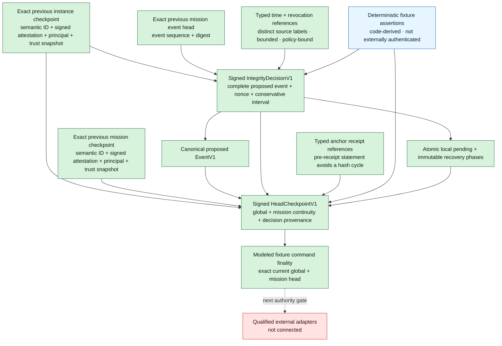

# Etzio

**An evidence-native operating system for authorized vulnerability research.**

Etzio is designed to turn an exact authorized target into a governed, replayable research
chain:

```text
authority → immutable target → hypotheses → candidates → exploit proof
          → independent reproduction → adjudication → disclosure draft → learning
```

The mission spans vulnerability classes, languages, and target categories. Blockchain,
Solidity, EVM, and later L1/client research are the first benchmark and economic wedge—not
the architectural ceiling. Domain knowledge belongs in versioned packs; policy and
scientific authority remain in the kernel.

> **Status — architecture foundation, 2026-07-29.**
> One repository-fixture candidate-generation path is implemented end to end. It admits a
> signed authority record, resolves immutable content-addressed bytes, executes a narrow
> Python analyzer under a bounded lease, and commits lifecycle-checked events to SQLite. A
> verification-intent mission can also retain a kernel-issued, authority-bound
> modeled-fixture verification lease for a retained candidate, resolve every target and
> predeclared verification-input byte under an exact content-identity type, and atomically
> admit one authenticated modeled receipt while consuming its lease. A versioned SQLite
> evidence vault now commits the exact BLOBs, code-derived role mappings, and canonical
> event together at all four implemented byte-claiming boundaries; the filesystem evidence
> store is staging and cache only. The receipt signs the retained resolution and four exact
> typed output digest/size pairs. Explicit expiry, modeled cancellation, atomic
> reassignment, and receipt-coverage closure recover verification-intent missions without
> rewriting history. A separate empty-history-only schema-v2 profile now commits every
> event with a signed integrity decision and completes a crash-recoverable modeled anchor,
> checkpoint, and exact-current-head sequence before its fixture command returns. Its
> clocks, revocation sources, anchor, catalog, and monitor are deterministic
> repository-owned fixtures—not external authority. Etzio does not construct or execute
> exploits, establish that those opaque outputs came from an execution, adjudicate a
> finding, access a live target, or learn. No production-readiness or superiority claim is
> made.

## Why Etzio

A vulnerability is a falsifiable claim, not an alert. A candidate identifies a specific
observation against specific bytes. A finding requires a separately authorized verifier to
reproduce a security-relevant effect from retained artifacts in an independently controlled
environment, followed by kernel adjudication.

That yields six operating laws:

1. authority is admitted before a mission opens;
2. workers propose; the kernel alone changes canonical state;
3. a generator cannot verify its own candidate;
4. evidence and identities are content-bound and replayable;
5. refusals, nulls, failures, timeouts, and inconclusive results remain visible; and
6. credentials, egress, spending, live actions, disclosure, and publication are separate
   grants.

## Implemented vertical slice

The supported `etzio` command can analyze only the two repository-owned manifest fixtures
and closes each completed scan:

```text
manifest fixture → content-addressed target snapshot
  → ephemeral operator key + target-bound signed fixture grant
  → self-verifying authority admission
  → bounded analysis lease
  → byte-bound Python AST observations
  → stable candidate envelopes
  → append-only lifecycle-validated SQLite events
  → deterministic replay
  → terminal closure
```

An explicit fixture-only kernel path may instead admit both `static_analysis` and
`modeled_fixture_verification`, retain a completed scan with candidates, issue an AQUILA
verification lease, resolve its predeclared inputs under code-owned artifact types, retain
one canonical ETZIO resolution event, and admit one signed modeled receipt. A single
`verifier_receipt_admitted` event retains the decision trust snapshot and four code-derived
typed output bindings while consuming the lease. A canonical lease lineage can also retain
explicit expiry, pre-deadline modeled cancellation, or atomic reassignment to a different
verifier, then close with exact complete or incomplete receipt coverage. This is
authenticated statement and lifecycle-decision retention—not PoC, oracle, or verifier
execution and not finding adjudication.

When that repository-fixture flow is attached to the exact
`ModeledIntegrityFinalizingEventStoreV1` facade on an empty store, each event first commits
with its complete signed decision dossier, then advances through retained anchor statement,
signed checkpoint candidate, and exact-current external-floor records. Recovery repeats
only the same byte-bound anchor registration and checkpoint publication. The ordinary
fixture CLI remains on the legacy profile; the modeled finality facade is a deterministic
qualification surface, not production external authority.

The command has no arbitrary target-path option. It emits candidates only; neither fixture
path can mint a finding, execute a PoC, use the network, access credentials, spend,
disclose, or publish.

The protocol-v1 foundation includes:

- canonical JSON with duplicate-key rejection, Unicode 17.0.0 NFC, signed 64-bit integers,
  fixed resource ceilings, and full domain-separated SHA-256 identities;
- an installed Draft 2020-12 semantic wire schema with exact branches for all eleven typed
  object kinds and all eighteen event payload variants;
- Ed25519 authority and modeled-receipt attestations, including prime-subgroup public-key
  validation before a key can enter a trust snapshot;
- required-attestation contracts for pre-transition integrity decisions and
  post-transition head checkpoints, with proposed-event binding, conservative time
  intervals and ordering, context-typed provider evidence, exact current and predecessor
  signed-attestation provenance, scope-bound nonstale revocation/head floors, and distinct
  principals;
- an irreversible schema-v2 modeled-integrity profile for an empty history, with atomic
  event-plus-pending retention, four append-only recovery phases, byte-exact two-stage
  idempotency, one instance-global pending barrier, and exact current global/mission floor
  finalization before the modeled facade returns;
- exact-type composition boundaries that copy trust and policy inputs and rebuild fresh
  authenticated snapshots from verified wire before continuity logic runs;
- exact fixture manifests, a bounded private filesystem staging/cache store, and a
  canonical SQLite evidence vault retaining exact immutable BLOBs;
- immutable target, authority, lease, candidate, receipt, and event objects;
- kernel-issued verification-lease events binding retained authority, target, candidate,
  modeled-fixture grant evidence, and the exact issuance-trust snapshot identity;
- type-domain-separated verification-input identities plus one replayable resolution event
  that binds every target, PoC, supporting-evidence, environment, and oracle-specification
  byte to the retained lease;
- a signed receipt binding that exact resolution plus execution, effect,
  measured-environment, and termination output digest/size pairs under four separate
  code-owned artifact types;
- one atomic receipt-admission event that retains the complete decision trust view,
  preserves every allowed verdict, and derives single-use lease consumption through
  replay;
- explicit lease expiry, modeled cancellation, atomic nonbranching reassignment, and
  terminal receipt-coverage events with exhaustive candidate partitions;
- atomic event, role-mapping, and BLOB retention for `authority_admitted`,
  `mission_opened`, `verification_artifacts_resolved`, and
  `verifier_receipt_admitted`, with code-derived manifests, staging-independent committed
  replay/retry, and fail-closed corruption handling;
- a strict Etzio-identified and versioned SQLite schema with explicit refusal of nonempty
  pre-vault state, bounded direct BLOB ingestion, and a configurable per-opening logical
  evidence-storage ceiling that defaults to 1 GiB and charges distinct vault BLOBs,
  integrity-provider BLOBs, canonical integrity-phase records, and modeled profile,
  policy, and fixture-adapter authority-binding bytes; enrollment and each pending append
  additionally preflight 80 MiB of worst-case finality headroom;
- uniform compare-and-append SQLite `DELETE`/`EXTRA` storage across every declared runtime,
  with pre-open WAL-header refusal, loaded-version/fix diagnostics, and fail-closed
  authentication of journal mode, synchronization, foreign keys, trusted schema, CHECK
  enforcement, read isolation, and writable-schema state on cached replay and every writer
  boundary; and
- known-bad tests for signature, scope, identity, lifecycle, budget, corruption, replay,
  and filesystem-boundary failures.

CPython 3.11.15/SQLite 3.53.1 and CPython 3.14.2/SQLite 3.51.2 both use the
same rollback-journal policy. Canonical verification records the runtime-reported SQLite
version and source ID and rejects a different SQLite identity under the repository import
context. This is dependency evidence, not binary provenance or a general storage-safety
claim.

## System map

This diagram distinguishes retained implementation from behavior models. A solid arrow is
a currently retained repository-fixture flow; a dashed arrow crosses a blocked or
unconnected gate.

```mermaid
flowchart LR
    AQ["AQUILA<br/>authority · budgets · leases"]
    K["ETZIO kernel<br/>protocol · lifecycle · replay"]
    S[("Filesystem staging/cache<br/>bounded pre-ingestion bytes")]
    DB[("SQLite evidence vault<br/>BLOBs · role mappings · events")]
    V["VELITES<br/>byte-bound AST observations"]
    C["Stable candidates<br/>not findings"]
    L["Modeled verification lease<br/>resolution · recovery"]
    M["MARCELLUS<br/>isolated proof construction"]
    T["CATO<br/>independent reproduction"]
    R["Modeled receipt admission<br/>opaque signed outputs"]
    A["CAMILLUS<br/>finding adjudication"]
    F["FABRICIUS<br/>disclosure draft"]
    N["MINERVA<br/>offline promotion"]

    AQ --> K
    S -->|"first canonical ingestion"| K
    K <--> DB
    K --> V --> C --> L
    L -->|"modeled statement only"| R
    L -. "proof construction + isolation absent" .-> M
    M -. "separate verifier absent" .-> T
    T -. "structured receipt evidence absent" .-> R
    R -. "no finding authority yet" .-> A
    A -. "external-write grant required" .-> F
    A -. "frozen evaluation gate required" .-> N

    classDef implemented fill:#d8f3dc,stroke:#2d6a4f,color:#081c15;
    classDef modeled fill:#fff3bf,stroke:#e67700,color:#3b2f00;
    class AQ,K,S,DB,V,C,L,R implemented;
    class M,T,A,F,N modeled;
```



The integrity tranche now has modeled runtime enforcement, while real authority remains
blocked:



| Plane | Unit | Responsibility | Repository status |
|---|---|---|---|
| Control | **ETZIO** | protocol, lifecycle, event ledger, replay | implemented for the fixture scan |
| Governance | **AQUILA** | authority, scope, budgets, leases | fixture analysis plus modeled-verification issuance, cancellation, and reassignment implemented |
| Recon | **SCIPIO** | target and attack-surface mapping | modeled |
| Strategy | **FABIUS** | ranked falsifiable hypotheses | modeled |
| Investigation | **VELITES** | leased probes and candidates | narrow byte-bound Python AST slice |
| Proof | **MARCELLUS** | isolated exploit construction | modeled; isolation absent |
| Verification | **CATO** | independent reproduction and verdict | CATO behavior modeled; ETZIO receipt admission implemented; execution and independence absent |
| Adjudication | **CAMILLUS** | evidence completeness, dedup, severity | modeled |
| Disclosure | **FABRICIUS** | evidence-bound report draft | modeled; no external write |
| Learning | **MINERVA** | evaluated offline strategy promotion | modeled |

The original in-process behavior model remains available as `python -m etzio.cli`, but its
toy findings and verifier labels are not security evidence.

## Reproduce

The canonical interpreter is CPython 3.11.15; CI also reproduces the suite on CPython
3.14.2. Validation dependencies are exact and hash-locked.

```bash
git clone git@github.com:manfromnowhere143/etzio.git
cd etzio
python3.11 -m venv .venv
.venv/bin/python -m pip install \
  --no-input \
  --require-hashes \
  --only-binary=:all: \
  --requirement tools/ci/requirements-ci.lock
.venv/bin/python -m pip check
ETZIO_PYTHON=.venv/bin/python make verify
```

Run the governed fixtures:

```bash
.venv/bin/etzio --fixture vulnerable
.venv/bin/etzio --fixture clean
```

To retain replay state, provide a new path or an existing owner-controlled directory whose
mode is already `0700`:

```bash
mkdir -m 700 .etzio-state
.venv/bin/etzio --fixture vulnerable --state-dir .etzio-state
```

Existing persistent-WAL databases and nonempty pre-vault event databases are refused.
Neither conversion tool exists yet. Use a fresh state path and preserve the refused
database plus journal bytes unchanged until an explicit stop-the-world migration is
implemented and qualified.

An exact `user_version = 1` transactional-vault database is the narrow exception: opening
it atomically installs the version-2 integrity tables under the permanent legacy profile
without relabeling any retained event as finalized. Only an entirely empty legacy profile
can enroll in modeled integrity finality.

## Open gates and next mission

The next mission is not more detector breadth. Kernel-issued modeled-fixture assignments,
typed input resolutions, atomic modeled-receipt admission, explicit lease recovery, and
the typed integrity-evidence contract are retained. The schema-v2 deterministic fixture
profile pins its exact policy, trust store, adapter profile, decision and checkpoint
principals, and service scope; proves atomic pending retention, byte-exact two-stage
recovery, signed checkpoint persistence, multi-mission global and mission continuity, and
exact-current-head command completion from event zero; and blocks generic replay while
any modeled transition is unresolved. Its provider assertions are canonical,
code-derived fixture claims—not authenticated external observations. The transactional
SQLite vault closes the ordinary filesystem-staging/SQLite retention split for all four
implemented byte-claiming event boundaries. Completing the foundation-integrity boundary
still requires:

1. qualify independently administered trusted-time, revocation, anchor, catalog, and
   monitor adapters, then replace the deterministic fixture sources at consequential
   command boundaries without weakening the retained recovery contract;
2. close the documented same-user SQLite pathname and coherent offline-rewrite boundary;
3. accept and qualify a concrete SQLite/VFS/filesystem/device profile, physical and journal
   quotas, backup/restore, and process-kill and power-fault recovery; sensitive evidence
   also requires access-control, encryption, and retention policy;
4. replace opaque modeled outputs with structured, independently produced execution
   evidence; and
5. prove MARCELLUS/CATO separation on an explicitly accepted Linux/KVM profile.

Only then should Etzio run the benchmark-first EVM pack. Live bounty work remains a later,
target-specific authorization stage.

## Project record

- [Session handoff](docs/SESSION_HANDOFF.md)
- [Machine-readable mission state](docs/MISSION_STATE.json)
- [Charter](CHARTER.md)
- [Architecture](docs/ARCHITECTURE.md)
- [Roadmap](docs/ROADMAP.md)
- [2026 frontier baseline](docs/FRONTIER_BASELINE.md)
- [Protocol-v1 semantic wire schema](etzio/schemas/protocol.v1.schema.json)
- [Architecture decisions](docs/decisions/README.md)
- [Security policy](SECURITY.md)
- [Contributing](CONTRIBUTING.md)

Etzio is private and solely authored by [Daniel Wahnich](AUTHORS.md).
